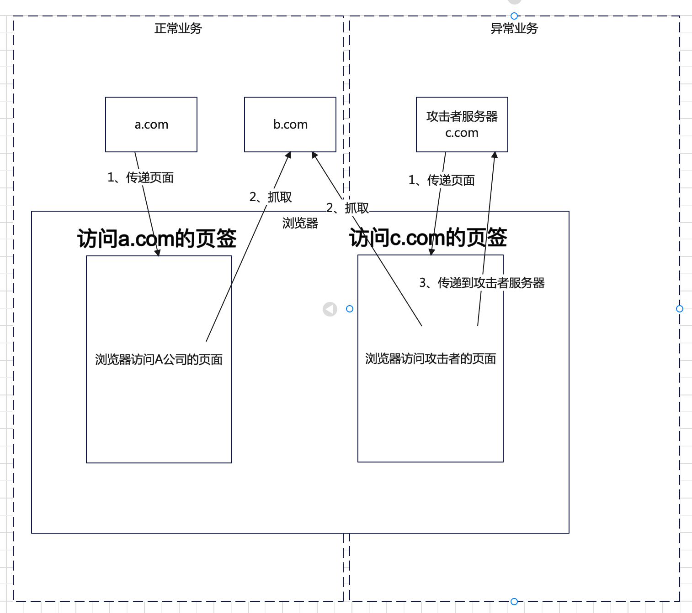

## 1.同源策略
同源策略是浏览器的一种安全策略。同源策略限制从一个源加载的文档或脚本与来自另一个源的资源进行交互,这是一个用于隔离潜在恶意文件的关键的安全机制.

“同源”包括三个条件:

    同协议
    同域名
    同端口

attacker.me = 攻击者
victim.me = 受害者

同源策略的具体表现举例:当attacker.me试图获取victim.me下的资源,浏览器会阻止返回该资源。

```
<script type="text/javascript">
    var xhr = new XMLHttpRequest();
    xhr.onreadystatechange = function() {
        if(xhr.readyState === 4) {
            console.log(xhr.responseText);
        }
    }
    xhr.open("GET", "http://victim.me/secret");
    xhr.send();
</script>
```


(该请求虽然发出去了,但浏览器拒绝返回响应内容)

反之请求受害者网站就可以获取消息


同源策略之中，下列标签天生具备跨域能力,形象比喻，下列标签天生具备，在浏览器端，去<b>抓取</b>不同源的资源的能力
```html
所有带src或href属性的标签以及部分其他标签可以跨域:

<script src="..."></script>

<video src="..."></video>
<audio src="..."></audio>
<embed src="...">
<frame src="...">
<iframe src="..."></iframe>
<link rel="stylesheet" href="...">
<applet code="..."></applet>
<object data="..." ></object>

@font-face可以引入跨域字体。

  <style type="text/css">
    @font-face {
      src: url("http://developer.mozilla.org/@api/deki/files/2934/=VeraSeBd.ttf");
    }
  </style>
```


## 2. 跨域
跨域想解决的问题是，浏览器绕过浏览器的同源策略控制,在浏览器端去抓取其他网站的东西，包括请求其他网站的json，其他网站的html，注意形式化表示<b>东西</b>即资源，其他网站即<b>非同源</b>

常见解决跨域的需求的方式是使用JSONP和CORS

### 2.1 跨域的安全问题
如下图所示



正常业务：浏览器访问a.com，获取a.com的html渲染浏览器，a.com由于业务需要，需要获取b.com的资源，因此浏览器此刻去抓取b.com的内容用于页面渲染或者页面逻辑处理

异常业务：当浏览器已经登陆了a.com，或者未登陆在a.com做正常业务，此时点击了c.com的业务，这里攻击者可以自己搭建一个c.com的网站给受害者发送一个链接，或者在a.com的正常业务录入一个c.com的链接。此时c.com受到攻击者控制，执行1、传递页面 2、浏览器会此时管理的cookie会被携带从b.com抓取资源 3、传递从b.com抓取的资源到c.com。

如果b.com发送的资源是用户的个人信息或者敏感数据，则c.com会收到这些个人数据和敏感信息。


## 3.JSONP漏洞
JSONP跨域巧妙的利用了script标签能跨域的特点,实现了json的跨域传输。

实例,例如这样一个获取客户端IP的接口,


callback参数从客户端传入,返回的hack({"ip": "***.***.159.159"});,形式正好是在调用hack()函数。

所以只要我们在调用该接口处事先定义好这个hack()函数,就能获取到传入的参数{"ip": "***.***.159.159"},从而实现了json的跨域传输。

<!-- jsonp_hijack.html -->
``` html
<script>
function addScriptTag(src) {
  var script = document.createElement('script');
  script.setAttribute("type","text/javascript");
  script.src = src;
  document.body.appendChild(script);
}
​
window.onload = function () {
  addScriptTag('http://ip.jsontest.com/?callback=ip');
}
​
function ip(data) {
  alert(data.ip);
};
</script>
```


### 3.1 漏洞成因
>1、用于跨域的callback函数名称用户可控

>2、服务端未校验refferer

### 3.2 攻击方式
使用下图的方式录入c.com的网站，或者诱导用户点击c.com的网站，并加载恶意的html


### 3.3 防御方式
```
1、架构设计，弃用跨域请求的方式
2、服务端校验refferer，设置refferer白名单
```

### 3.4 自动化检测方式
```
1、检测callback等web参数，变异输入，检测是否在响应中收到变异输入
2、获取抓取资源的请求包，变异refferer为非当前域的域名，检测是否收到同样响应
3、1和2同时满足则存在JSONP跨域漏洞
```
